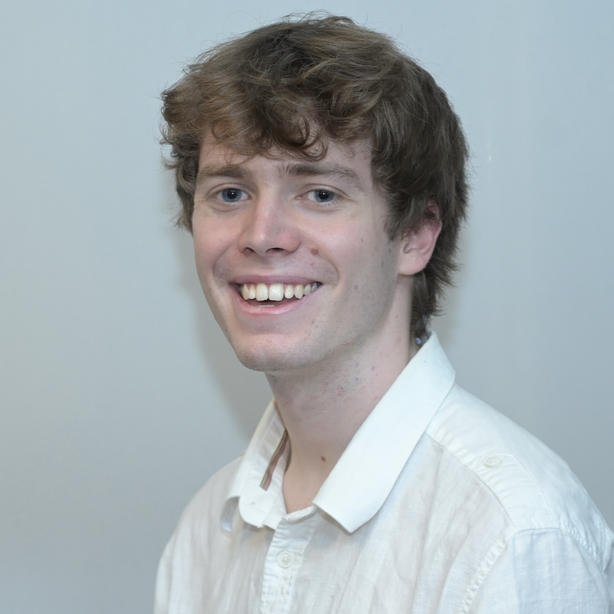

  

    
  

  

## About Me  

Hi, I'm Barnaby! I'm currently doing research at the University of Oxford in combinatorial quantum field theory under [Paul Balduf](https://paulbalduf.com/). In both my spare time and research I do a lot of coding, feel free to check out my [GitHub](https://github.com/BarnabyOBrien). On this website you can see many of my [current and previous projects](), as well as [posts]() based of previous talks I have given. 

I have a large interest in Large Language Models (LLMs) and the associated AI saftey. I am currently upskilling myself working through ARENA's [AI saftey curriculum](https://www.arena.education/curriculum), as well as competiting in many [Kaggle competitions](https://github.com/BarnabyOBrien/Top-3-Kaggle-Ranking).

  

