*Based on two talks I gave on symbolic regression neural networks. The neural network crash course follows Michael Nielsen's [Neural Networks and Deep Learning](http://neuralnetworksanddeeplearning.com/chap1.html); the Equation Learner material follows Kim et al. (2021), and the final section follows the AI Feynman 2.0 paper by Udrescu et al. (2020). Full references at the [bottom](#references).*

## Contents

1. [Fitting equations, not curves](#introduction)
2. [A crash course in neural networks](#crash-course)
3. [Interactive: backpropagation, demon's-eye view](#demo-backprop)
4. [Turning a network into an equation](#eql)
5. [Interactive: sparsity discovers the formula](#demo-sparsity)
6. [The EQL in action: rediscovering mechanics](#action)
7. [AI Feynman 2.0](#ai-feynman)
8. [What's next?](#conclusion)
9. [References](#references)

## Fitting equations, not curves {#introduction}

**Symbolic regression (SR) fits an equation to data.** Not a smoothed curve, not a million tuned weights — an actual formula you can write on a blackboard.

Physicists have been doing this by hand for centuries. Kepler stared at Tycho Brahe's tables until he deduced that orbits are ellipses (1601). Coulomb extracted his inverse-square law from torsion-balance data (1785). The gas laws came out of decades of careful measurement (1662–1811), and Planck's radiation law (1900) was famously a formula fitted to blackbody data *before* he understood why it worked. Every one of these was symbolic regression, performed by a human, and every one was a breakthrough.

The dream is to automate that. The difficulty is that the space of possible formulas is combinatorially enormous — you can't just gradient-descend through "all equations". This post covers one family of answers: **make the neural network itself the formula**, then squeeze it until only the formula is left. To see how, we need to know how an ordinary network works first.

## A crash course in neural networks {#crash-course}

The classic entry point (this section follows Nielsen's book) is teaching a network to read handwritten digits from the MNIST database:

<figure style="margin:0;">
  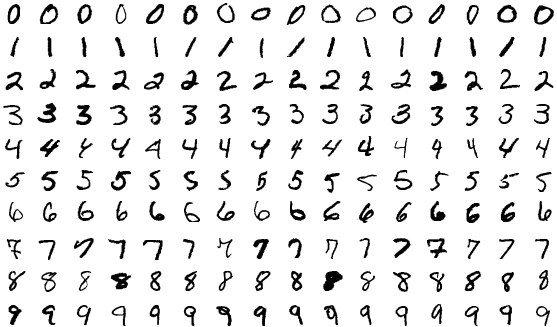
  <figcaption><strong>Fig. 1</strong> — MNIST digits. Trivial for you; surprisingly deep for a machine.</figcaption>
</figure>

A network is layers of *neurons* connected by weighted edges. Each neuron takes the outputs of the previous layer, forms a weighted sum, adds a bias, and squashes the result through an **activation function** \(\sigma\) — typically a sigmoid or \(\tanh\). Intuitively each neuron "weighs up the evidence" arriving on its inputs and reports a confidence between 0 and 1:

$$
\vec{a}^{\,l} = \sigma\!\left(W^l \vec{a}^{\,l-1} + \vec{b}^{\,l}\right)
$$

Chain the layers together and the whole network is one big nested function mapping pixels to predictions:

<figure style="margin:0;">
  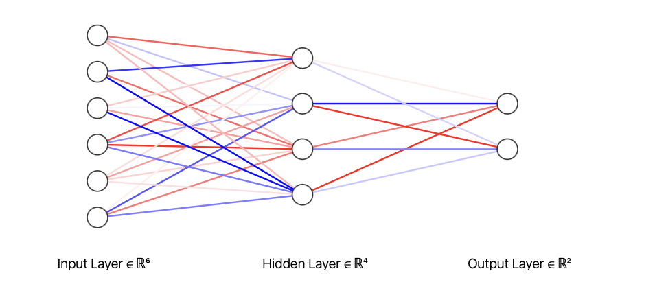
  <figcaption><strong>Fig. 2</strong> — a fully connected network. The lines carry each neuron's output; their colours are the weights applied to it.</figcaption>
</figure>

At initialisation it's a *random* function. Training means measuring how wrong it is — the **cost function**, just a mean squared error (MSE),

$$
C = \frac{1}{2n}\sum_{x} \left\lVert \vec{y}(x) - \vec{a}^{\,L}(x) \right\rVert^2
$$

— and then adjusting weights and biases to reduce it. If \(C\) had two parameters you could picture a ball rolling downhill. Our little digit-reader has **25,574 parameters**, so we need the hill-rolling to be organised: *stochastic gradient descent*, with the gradients delivered efficiently by **backpropagation**.

Backprop assigns each neuron an "error" \(\delta\) — how much the cost would change if that neuron's input were nudged — computed backwards from the output layer:

$$
\delta^{L} = (\vec{a}^{L} - \vec{y}) \odot \sigma'(\vec{z}^{L}), \qquad
\delta^{l} = \left( (W^{l+1})^{T} \delta^{l+1} \right) \odot \sigma'(\vec{z}^{l})
$$

Once you know every \(\delta\), every gradient is free: \(\partial C / \partial w^l_{jk} = a^{l-1}_k \delta^l_j\).

## Interactive: backpropagation, demon's-eye view {#demo-backprop}

In the talk this was an animation: Nielsen's picture of a little demon sitting inside each neuron, twiddling its input and reporting how much the cost complains. Step through it below — forward pass first, then watch the demons carry the error backwards.

<svg id="bp-svg" viewBox="0 0 560 260" style="width:100%; max-width:560px; display:block; margin:0 auto;" aria-label="Backpropagation demo network"></svg>

<button id="bp-back" style="padding:0.35rem 0.9rem; margin:0 0.2rem; cursor:pointer;">◀ Back</button>
<button id="bp-step" style="padding:0.35rem 0.9rem; margin:0 0.2rem; cursor:pointer; font-weight:bold;">Step ▶</button>
<button id="bp-reset" style="padding:0.35rem 0.9rem; margin:0 0.2rem; cursor:pointer;">Reset</button>

Repeat forward-pass → backprop → nudge over many mini-batches (an *epoch* is one pass through all the data) and the cost falls until the network reads digits it has never seen. Trained — but *opaque*. 25,574 numbers is not an explanation of anything.

## Turning a network into an equation {#eql}

Here is the key move of a symbolic regression neural network, usually called an **Equation Learner (EQL) network** (Kim et al. 2021). Take the network above and make one change: **replace the uniform activation function with a different mathematical primitive at each neuron** — identity, \((\cdot)^2\), \(\sin(\cdot)\), multiplication of pairs, and so on:

<figure style="margin:0;">
  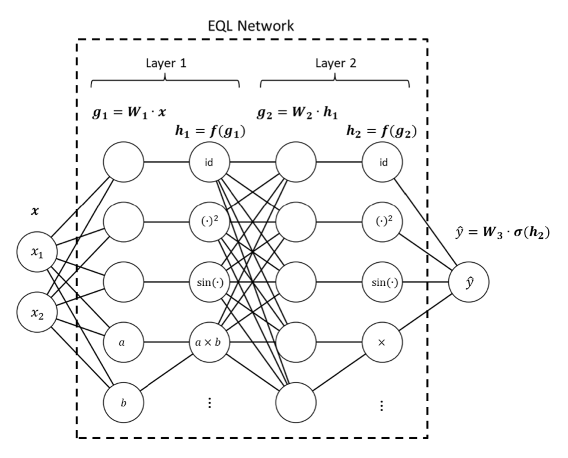
  <figcaption><strong>Fig. 3</strong> — the EQL architecture from Kim et al. Weights form linear combinations exactly as before, but each neuron applies a different primitive function.</figcaption>
</figure>

Nothing about training changes — it's still differentiable end-to-end, so backprop works untouched. But now the network *is* a formula: composing the layers writes out some nested algebraic expression. The catch is that a freshly trained EQL is a **very complicated but correct** formula — hundreds of terms, all overlapping. To perform symbolic regression we must make it *sparse*: kill off as many weights as possible so a short expression remains.

Sparsity comes from adding a penalty to the cost function,

$$
L_q = \frac{1}{N}\sum_{i}\left\lVert \hat{y}_i - y_i \right\rVert^2 + \lambda \sum_{j} \lvert w_j \rvert^{q}
$$

The harshest complexity penalty would be \(q = 0\) (count the nonzero weights), but that's an NP-hard combinatorial problem. \(q = 1\) (LASSO) is friendly but under-penalises. The sweet spot used here is \(q = 0.5\) — except \(L_{0.5}\) has an infinite gradient at \(w = 0\), which stalls training. The fix is a *smoothed* \(L_{0.5}^{*}\) that swaps in a well-behaved polynomial below a threshold \(a\):

  <figure style="flex:1; min-width:260px; margin:0;">
    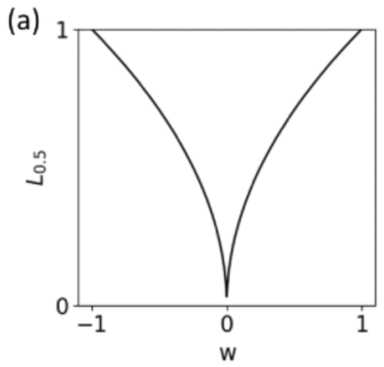
    <figcaption><strong>Fig. 4a</strong> — the raw L₀.₅ penalty: the gradient blows up at w = 0.</figcaption>
  </figure>
  <figure style="flex:1; min-width:260px; margin:0;">
    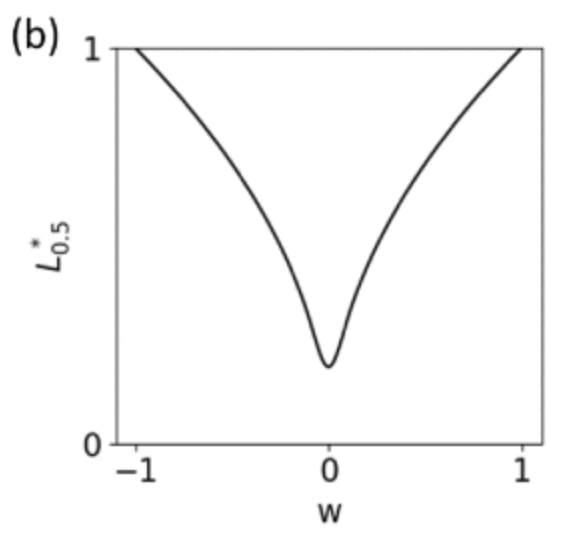
    <figcaption><strong>Fig. 4b</strong> — the smoothed L₀.₅* used in practice: same tails, finite gradient at the origin.</figcaption>
  </figure>

## Interactive: sparsity discovers the formula {#demo-sparsity}

Drag the regularisation strength and watch a tiny EQL network prune itself. Every edge that survives contributes a term; the formula underneath is what the network *is* at that sparsity. Too little pressure and the truth hides inside junk terms; too much and the model breaks. (True function: \(y = 0.5x^2 + \sin x\).)

<svg id="sp-svg" viewBox="0 0 560 220" style="width:100%; max-width:560px; display:block; margin:0 auto;" aria-label="EQL sparsity demo"></svg>

<label for="sp-slider" style="font-size:0.95em;">regularisation strength λ:</label>
<input id="sp-slider" type="range" min="0" max="4" value="0" step="1" style="width:60%; vertical-align:middle;">

This is the whole philosophy in one slider: **accuracy and simplicity trade off**, and somewhere on that trade-off curve sits a formula a physicist would recognise. Hold that thought — it returns as a *Pareto frontier* in the final section.

## The EQL in action: rediscovering mechanics {#action}

Kim et al. wired an EQL into a larger architecture and pointed it at physics. Take a simple harmonic oscillator — a mass on a spring, \(\ddot{u} = -\omega^2 u\) — and generate trajectories for many random spring constants:

<figure style="margin:0;">
  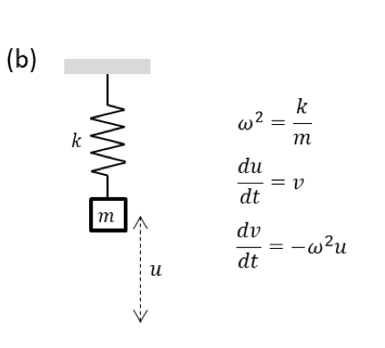
  <figcaption><strong>Fig. 5</strong> — the test problem: a mass on a spring.</figcaption>
</figure>

The clever part is the surrounding structure: a *dynamics encoder* compresses each observed trajectory into a latent parameter \(z\) (which training reveals to be essentially \(\omega^2\) — the network discovers the relevant physical variable on its own), and a *propagating decoder* unrolls an EQL cell repeatedly to predict the trajectory, exactly like a numerical integrator stepping through time:

<figure style="margin:0;">
  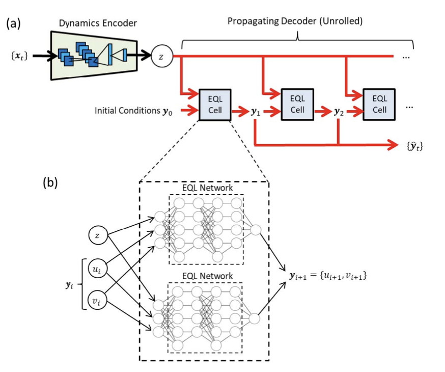
  <figcaption><strong>Fig. 6</strong> — architecture from Kim et al.: an encoder finds the physical parameter, an unrolled EQL cell learns the update rule.</figcaption>
</figure>

What update rule does the EQL learn? Read the extracted equations against the ground truth:

<figure style="margin:0;">
  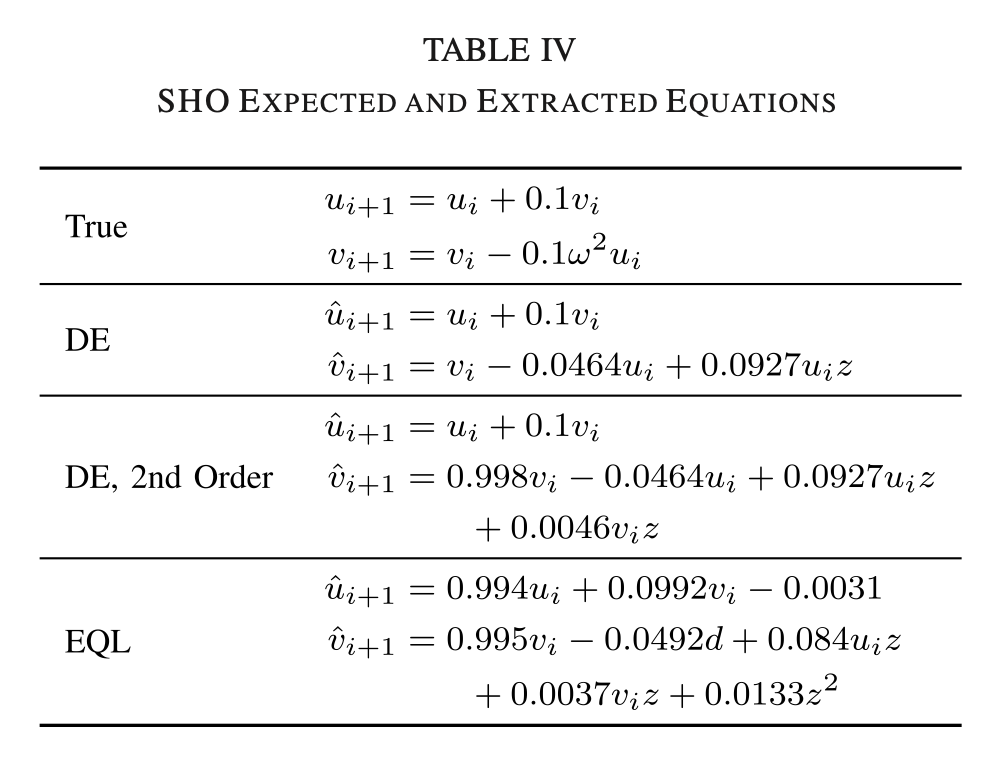
  <figcaption><strong>Fig. 7</strong> — extracted update rules (Kim et al., Table IV). The EQL's equation matches the Euler integrator — plus correction terms.</figcaption>
</figure>

The EQL rediscovers the **Euler method**, \(u_{i+1} = u_i + v_i\,\Delta t,\; v_{i+1} = v_i - \omega^2 u_i\,\Delta t\) — and then does slightly better, picking up higher-order correction terms (the authors note a larger EQL could plausibly reach Runge–Kutta). And because it learned an *equation* rather than a black-box map, it extrapolates beyond its training window far better than a standard ReLU network, which falls apart the moment it leaves familiar territory:

<figure style="margin:0;">
  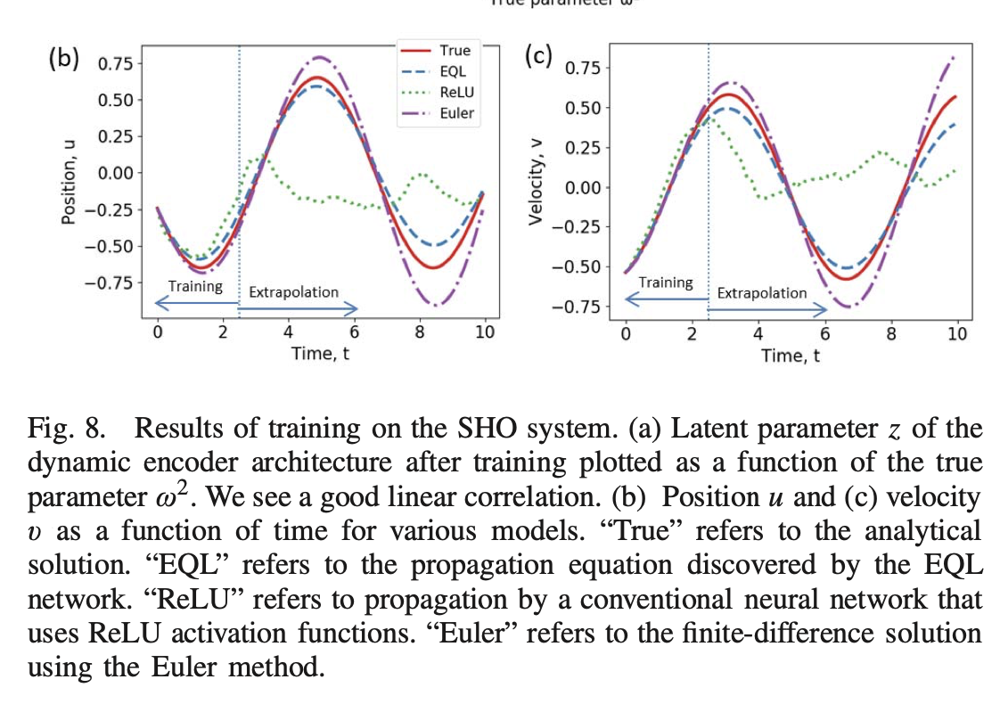
  <figcaption><strong>Fig. 8</strong> — extrapolation on the oscillator (Kim et al.). "True" vs EQL vs a conventional ReLU network vs Euler integration. The black-box network's extrapolation is visibly bad; the EQL tracks the physics.</figcaption>
</figure>

That is the payoff of symbolic regression in one picture: **equations generalise; black boxes interpolate.**

## AI Feynman 2.0 {#ai-feynman}

The EQL bakes the formula into the network. **AI Feynman 2.0** (Udrescu et al., 2020) flips the relationship: train an ordinary black-box network \(f_{\mathrm{NN}}\) to fit the data, then *interrogate it* to reverse-engineer the formula's structure. The name comes from its benchmark — 100 equations from the Feynman Lectures on Physics, which the method solves in full.

The central idea is **graph modularity**. Almost every physics formula, drawn as a computational graph, decomposes into modules with fewer inputs — e.g. \(f(x,y,z) = g\!\left[h(x,y), z\right]\) where \(h\) is simpler than \(f\). Because the trained network is differentiable, its *gradients* betray these decompositions: compositionality, symmetry and generalized additivity each leave a distinct fingerprint in \(\nabla f\) (for instance, if \(f(\mathbf{x}) = g(h(\mathbf{x}'))\,\) only through \(h\), the normalised gradient with respect to \(\mathbf{x}'\) is independent of the remaining variables — a smoking gun). Detect the fingerprint, split the problem, recurse on the smaller pieces until brute-force search or polynomial fitting can finish the job:

<figure style="margin:0;">
  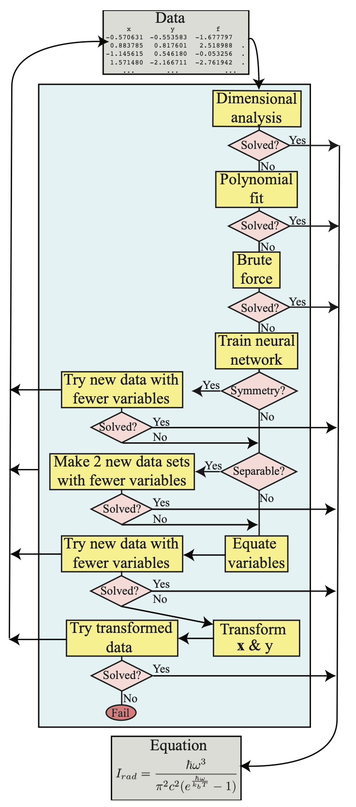
  <figcaption><strong>Fig. 9</strong> — the recursive AI Feynman pipeline: fit a network, hunt for modularity in its gradients, decompose, recurse.</figcaption>
</figure>

Three more ideas make it robust. First, instead of accepting one "best" formula, it maintains the whole **Pareto frontier** of accuracy versus description-length complexity — our slider's trade-off, formalised in bits. Convex corners of the frontier are where the interesting physics lives:

<figure style="margin:0;">
  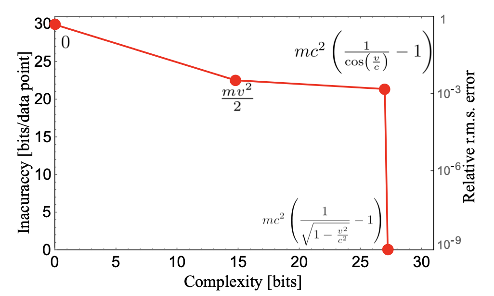
  <figcaption><strong>Fig. 10</strong> — Pareto frontier for kinetic energy data (Udrescu et al., Fig. 1). The corners are ½mv² (the classical approximation) and Einstein's exact formula.</figcaption>
</figure>

Feed it data on how kinetic energy depends on mass, velocity and the speed of light, and it doesn't just return the exact relativistic formula — it *also* hands you \(\tfrac{1}{2}mv^2\) as the best simple approximation. The Pareto frontier contains the physics *and* the physicist's intuition about when the simple version suffices.

Second, it swaps MSE for a **mean error description length**, which ignores outliers instead of being dragged by them, and it rejects candidate formulas by statistical hypothesis testing rather than a single bad data point. Third, using **normalizing flows**, it extends symbolic regression to probability distributions known only through samples — recovering, for example, hydrogen orbital densities.

The results: all 100 Feynman-Lecture equations solved; on noisy data it stays correct at noise levels typically **one to three orders of magnitude higher** than the original AI Feynman, solving 73 of 100 baseline problems even with noise at the \(10^{-1}\) level; and it cracked all 17 "mystery" equations that the previous state of the art had failed on.

## What's next? {#conclusion}

Symbolic regression neural networks close a loop that physics opened four centuries ago: Kepler fitted an ellipse by hand; an EQL fits an integrator by gradient descent; AI Feynman recovers a century of formulas from raw tables. The tools are genuinely usable today (`pip install aifeynman`), and the mainstream view the AI Feynman authors offer is worth repeating — *all* known physics formulas are Pareto-optimal approximations, accurate **and** simple, and we live in a golden age of datasets waiting to be compressed into equations.

What I'd like to explore next: SR on systems where we *don't* know the answer (that's the point, after all), physics-informed architectures that encode symmetries and conservation laws from the start, and — more modestly — whether an EQL can solve my Statistical Mechanics II problem sheet.

## References {#references}

1. S. Kim, P. Lu, S. Mukherjee, M. A. Gilbert, J. Li, V. Čeperić and M. Soljačić, "Integration of Neural Network-Based Symbolic Regression in Deep Learning for Scientific Discovery", *IEEE Transactions on Neural Networks and Learning Systems* **32**(9), 4166–4177 (2021). [doi:10.1109/tnnls.2020.3017010](https://doi.org/10.1109/tnnls.2020.3017010)
2. M. A. Nielsen, *Neural Networks and Deep Learning*, Determination Press (2015). [neuralnetworksanddeeplearning.com](http://neuralnetworksanddeeplearning.com/)
3. S.-M. Udrescu, A. Tan, J. Feng, O. Neto, T. Wu and M. Tegmark, "AI Feynman 2.0: Pareto-optimal symbolic regression exploiting graph modularity", *NeurIPS 2020*. [arXiv:2006.10782](https://arxiv.org/abs/2006.10782)
4. S.-M. Udrescu and M. Tegmark, "AI Feynman: A physics-inspired method for symbolic regression", *Science Advances* **6**(16) (2020). [doi:10.1126/sciadv.aay2631](https://doi.org/10.1126/sciadv.aay2631)
5. B. Moseley, "Physics-informed machine learning: from concepts to real-world applications", DPhil thesis, University of Oxford (2022). [ORA](https://ora.ox.ac.uk/objects/uuid:b790477c-771f-4926-99c6-d2f9d248cb23)

*Figures 1–8 are reproduced from Kim et al. [1] and Nielsen [2]; Figures 9–10 from Udrescu et al. [3].*
