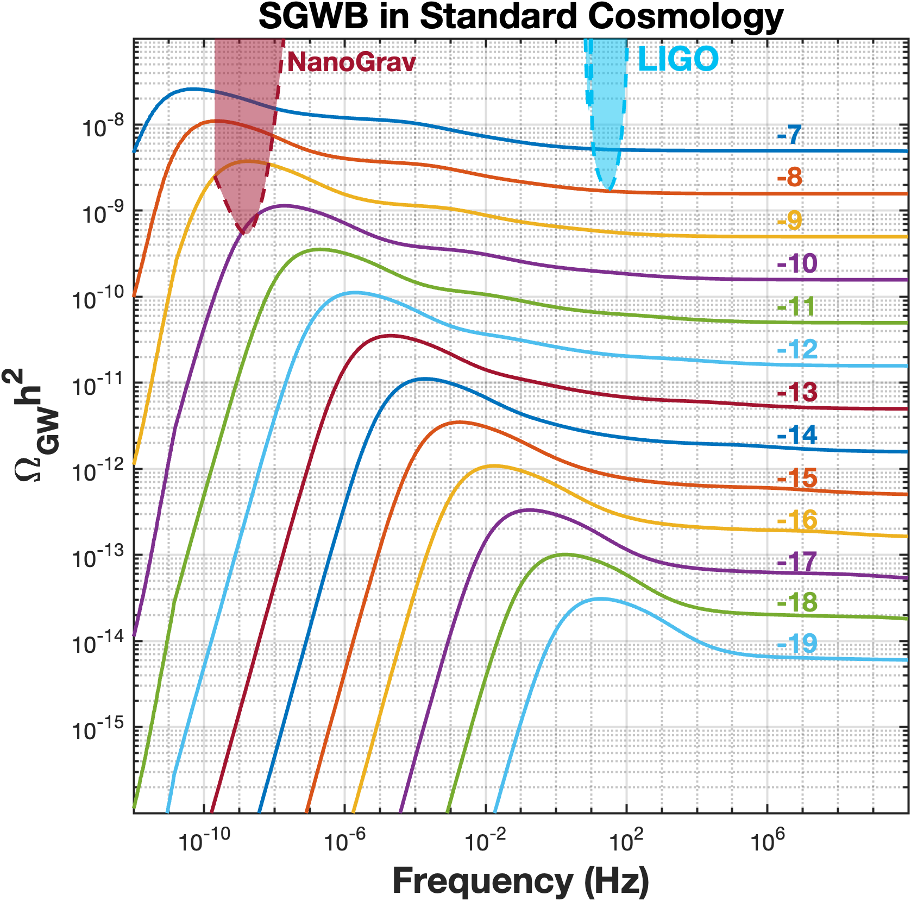
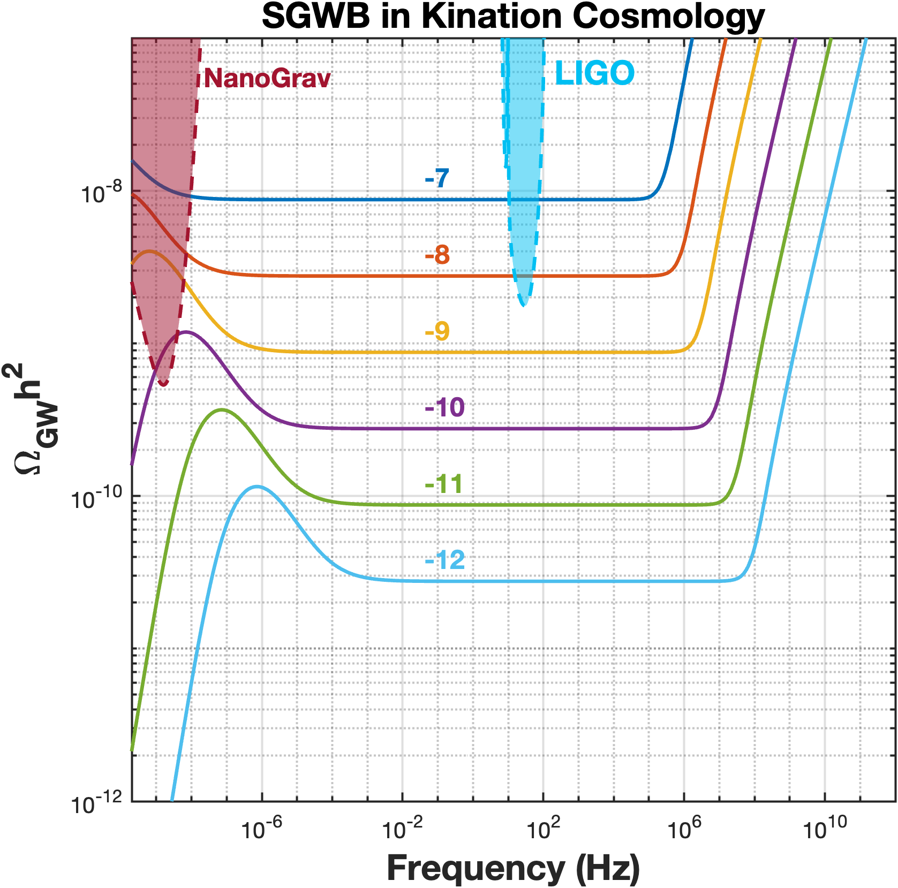
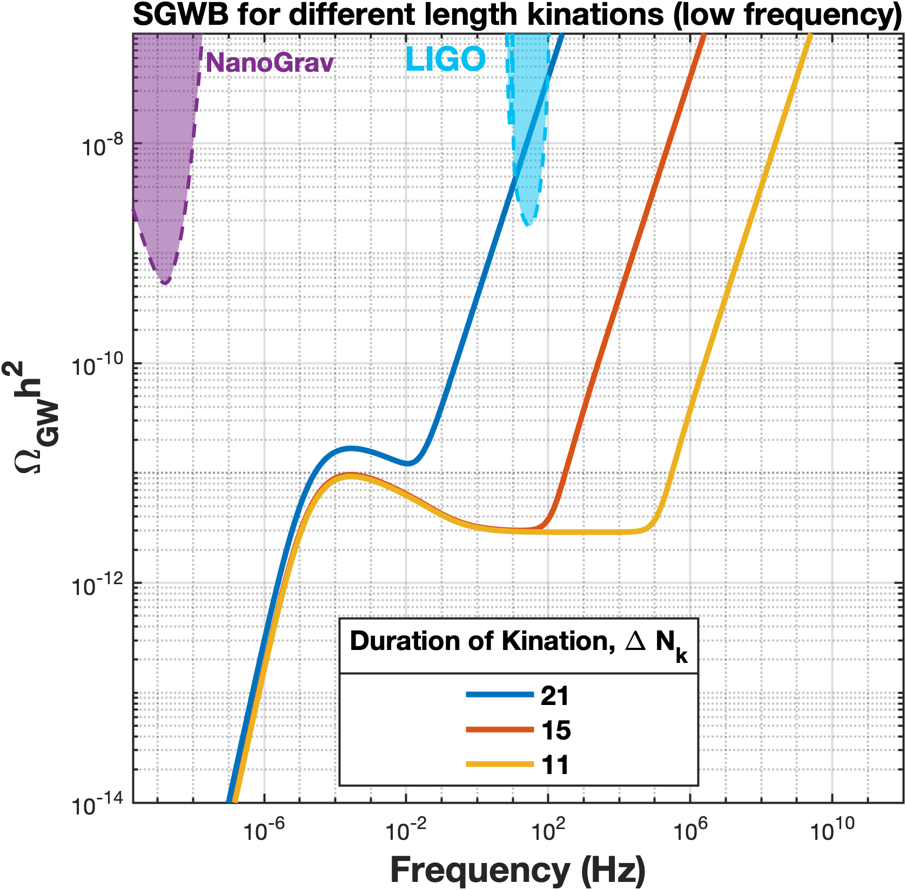
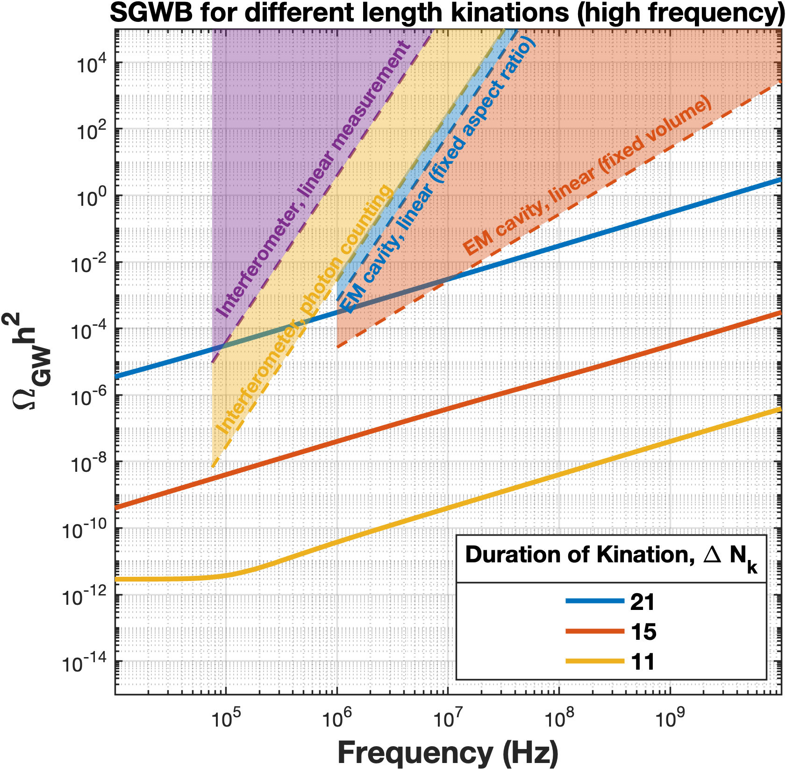
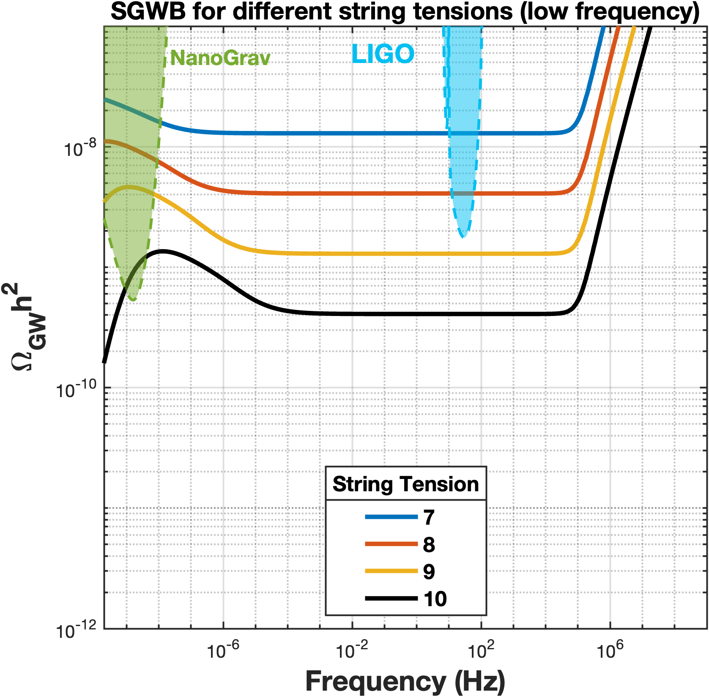
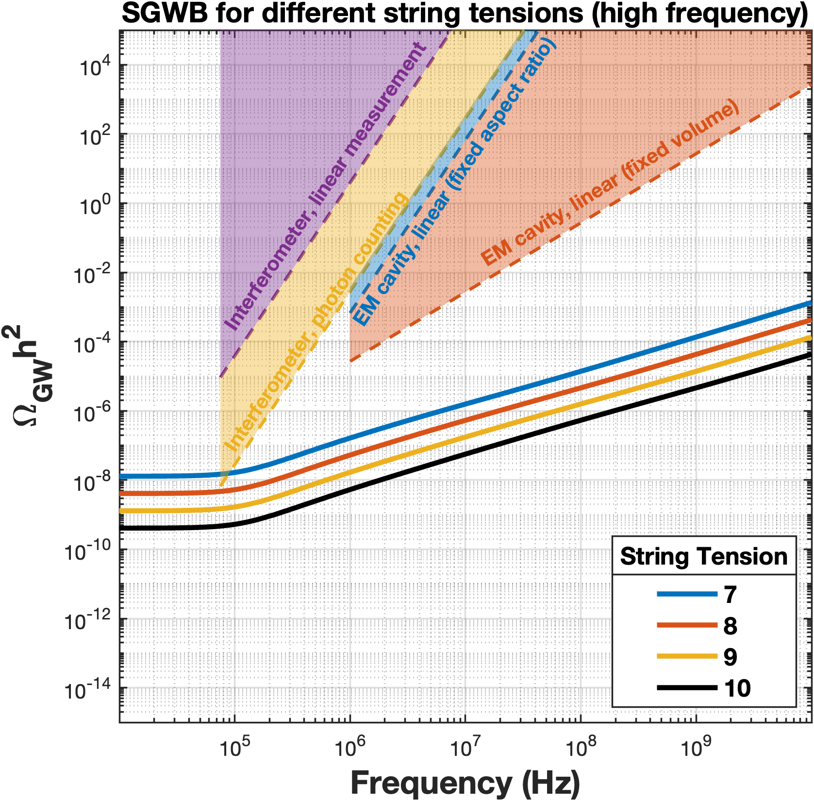

*This is a write-up of the main result of my Masters dissertation, "Cosmic Strings: Formation and Observations" (Oxford, Trinity 2026). The companion project on simulating the strings themselves is [here]().*

## Contents

1. [Introduction](#introduction)
2. [Background: the least understood three seconds](#background)
3. [Theory: cosmic strings as gravitational wave factories](#theory)
4. [Mathematical framework](#framework)
5. [Implementation in code](#implementation)
6. [Results and analysis](#results)
7. [Conclusion and next steps](#conclusion)
8. [References](#references)

## Introduction {#introduction}

Between the end of inflation (\(\sim 10^{-34}\,\mathrm{s}\)) and neutrino decoupling (\(\sim 1\,\mathrm{s}\)) sits a stretch of cosmic history that is remarkably hard to constrain observationally [[1]](#ref-1). One candidate resident of this era is **kination** — a non-standard cosmological epoch dominated by the kinetic energy of a scalar field. Several recent papers have argued that if a cosmic string network lived through a kination era, the era would imprint a distinctive tilt — a **kination peak** — on the stochastic gravitational wave background (SGWB) the network emits, potentially detectable by LIGO O5 or LISA [[3](#ref-3), [4](#ref-4), [5](#ref-5)].

In this project I computed the SGWB of a Nambu–Goto cosmic string network in standard and non-standard cosmologies, then asked a simple question: **what happens to that claim once you impose recent bounds on how long kination is allowed to last** [[6](#ref-6), [7](#ref-7)]**?** The answer: applying the bound \(\Delta N_k \lesssim 11\) pushes the kination peak above 5000 Hz — outside the range of LIGO O5, LISA, the Einstein Telescope and Cosmic Explorer — and below the fundamental quantum limit (FQL) of the high-frequency detector concepts considered. For this model, the kination peak is unlikely to be observed in the near future.

## Background: the least understood three seconds {#background}

The standard picture has inflation end in a matter-like phase, followed by reheating into radiation domination. But the duration of that intermediate phase is poorly constrained, leaving room for more exotic histories. Kination arises when the inflaton (or a field inheriting its energy density) rolls down a steep potential, so its kinetic energy dominates: the equation of state becomes \(w = 1\), and the total energy density redshifts as \(\rho \propto a^{-6}\) — faster than radiation. Micro-physical routes to this scenario include quintessence, string-compactification inflation and modified gravity [[2]](#ref-2).

Cosmic strings enter the story as *fossils* of the early universe. They are line-like topological defects that may form during spontaneous symmetry breaking, and once formed, the network keeps emitting gravitational waves throughout cosmic history. Because the SGWB at a given frequency is dominated by loops decaying at a particular epoch, the spectrum acts as a **logbook of the expansion history**: a kination era shows up as a rising tilt at high frequencies. The question is whether that tilt ever rises into a detectable window.

## Theory: cosmic strings as gravitational wave factories {#theory}

A cosmic string network has two populations: super-horizon *straight strings* and sub-horizon *loops*. Straight strings intercommute when they collide (a property I verified with my own field-theory simulations in the [companion project]()), chopping off loops. This is crucial — without it, straight strings would come to dominate the energy density of the universe. The loops then oscillate and decay by radiating gravitational waves, sourced predominantly by *cusps* and *kinks* on the loop.

The macroscopic evolution of the network is described by the **velocity-dependent one-scale (VOS) model** [[9](#ref-9), [10](#ref-10)], which tracks the characteristic length \(L\) and RMS velocity \(v\) of the network:

$$
\frac{dL}{dt} = HL(1 + v^2)+\frac{\tilde{c}\,v}{2}, \qquad
\frac{dv}{dt} = (1 - v^2)\left(\frac{k(v)}{L} - 2Hv\right)
$$

where \(\tilde{c}\) is the loop-chopping efficiency measured from simulations. In a radiation era the VOS equations admit a *scaling* solution, \(L \propto t\), which is what makes an analytic SGWB calculation tractable.

The SGWB itself is expressed through the dimensionless density parameter \(\Omega_{\mathrm{gw}}(t_0, f)\). The recipe: the power radiated by loops, \(P(f)\), combined with the loop number density \(n(\tilde f, \tilde t)\), integrated over emission times and redshifted to today. Decomposing the emission into harmonic modes \(k\), with cusps contributing \(P_k \propto k^{-4/3}\) and kinks \(k^{-5/3}\), and normalising the total radiated power to \(\Gamma G\mu^2\) with \(\Gamma \approx 50\) [[13]](#ref-13):

$$
P(f) = \sum_{k=1}^{\infty} G\mu^2 \left( C_{\mathrm{cusp}}\frac{\Gamma k^{-4/3}}{\zeta(4/3)} + C_{\mathrm{kink}}\frac{\Gamma k^{-5/3}}{\zeta(5/3)} \right)
$$

## Mathematical framework {#framework}

Putting the power spectrum and loop density together (loops of normalised length \(\alpha \approx 0.05\) dominate, taking \(10\%\) of the straight-network energy flux [[11](#ref-11), [12](#ref-12)]) gives the master equation actually evaluated in code:

$$
\Omega_{\mathrm{GW}} = \frac{1}{5}\, \frac{G\mu}{\alpha(\alpha+\Gamma G\mu)} \sum_{k=1}^{\infty} E(k,f) \int_{\log t_F}^{\log t_0} d\log \tilde{t}\; \tilde{t}\; D(\tilde{t},f,k)
$$

$$
E(k,f) = \frac{k}{f}\left( C_{\mathrm{cusp}}\frac{\Gamma k^{-4/3}}{\zeta(4/3)} + C_{\mathrm{kink}}\frac{\Gamma k^{-5/3}}{\zeta(5/3)} \right)
$$

$$
D(t,f,k) = \frac{\tilde{c}\,\bar{v}(t)\,\xi(t)^3}{\gamma\, t_i^4}\, e^{2\log a(t)}\, e^{3\log a(t_i)}\,\Theta(t-t_i)\,\Theta(t_i-t_{F})
$$

where \(t_i(f, \tilde t)\) is the formation time of the loops emitting at frequency \(f\) today.

**Adding kination.** The kination epoch is stitched into the cosmology as a piecewise energy density,

$$
\rho_{\mathrm{tot}} =
\begin{cases}
\rho_{\mathrm{start}} \left( \frac{a_{\mathrm{start}}}{a} \right)^{6} + \rho(a_{\mathrm{end}}) & \rho_{\mathrm{start}} > \rho > \rho_{\mathrm{end}} \\[4pt]
\rho_{\mathrm{end}}\,\Delta_R(T_{\mathrm{end}},T)\left( \frac{a_{\mathrm{end}}}{a}\right)^4 + \rho_{\mathrm{late}}(a) & \rho < \rho_{\mathrm{end}}
\end{cases}
$$

reducing the whole scenario to two knobs: the duration in e-folds, \(\Delta N_k = \ln(a_{KE}/a_{KS})\), and the energy scale \(E_{\mathrm{end}}\) at which kination hands back to radiation. Strings are taken to form at the *start* of kination — the optimum configuration for observability.

**The constraints.** Tensor perturbations from inflation are blue-shifted during kination, and their power spectrum is bounded at CMB decoupling via \(N_{\mathrm{eff}}\), giving \(\Delta N_k \lesssim 12.2 + 0.5 \ln(0.036/r)\) [[6](#ref-6), [8](#ref-8)]. More restrictively, if the kination field is the inflaton or inherits its energy density, the directly-constrained curvature power spectrum imposes

$$
\Delta N_k \lesssim 11
$$

independent of the tensor-to-scalar ratio [[7]](#ref-7). I also used a very conservative \(\Delta N_k \lesssim 15\), which holds across Starobinsky, power-law, Higgs and \(\mu\)-hybrid inflation.

Two analytic handles make the results interpretable, both derived in [[5]](#ref-5). The frequency at which the kination tilt begins is

$$
f_{\Delta}^{\mathrm{turning}} = \left(2 \times 10^{-3}\,\mathrm{Hz}\right) \left(\frac{T_{\Delta}}{\mathrm{GeV}}\right) \left( \frac{0.1 \times 50 \times 10^{-11}}{\alpha \Gamma G\mu} \right)^{1/2} \left( \frac{g_{*}(T_{\Delta})}{g_{*}(T_{0})} \right)^{1/4}
$$

and the slope of the kination peak follows \(\Omega_{\mathrm{GW}} \propto f^{4(1-3/m-1/n)}\), where \(n\) and \(m\) encode the expansion rate during network formation and GW emission. For our scenario this gives slopes of \(f^{4/3}\) (emission during kination) or \(f^{1/3}\) (emission during radiation).

## Implementation in code {#implementation}

The full pipeline was written from scratch in MATLAB (provided as Appendices A and B of the dissertation — deliberately, since the papers this work builds on do not publish their code). The SGWB calculation proceeds as:

1. Build a logarithmic 2D grid over emission time and frequency.
2. For each mode \(k\) (summed to \(k = 1000\)): compute the loop formation time \(t_i\) on the grid, evaluate the integrand surface \(D\), integrate along the time axis, and weight by \(E(k,f)\).
3. Sum the modes.

For non-standard cosmology, the scale factor \(a(t)\) has no closed form across the kination transition, so it is solved numerically from the Friedmann equations and then **interpolated**, which is what makes evaluating \(a(t_i)\) inside the integrand cheap. Any strings formed before kination begins are removed, accounting for dilution by inflation. Working in \(\log t\) keeps the integral well-conditioned over the ~30 orders of magnitude between string formation and today.

As a validation step, the standard-cosmology spectrum (below, left) reproduces the familiar flat radiation-era plateau and the low-frequency matter-era peak, matching published results before any kination physics is switched on.

  <figure style="flex:1; min-width:280px; margin:0;">
    
    <figcaption><strong>Fig. 1a</strong> — SGWB from Nambu–Goto strings in standard cosmology (Ωr = 8.24×10-5, ΩΛ = 0.69). Each line is a string tension Gμ = 10n.</figcaption>
  </figure>
  <figure style="flex:1; min-width:280px; margin:0;">
    
    <figcaption><strong>Fig. 1b</strong> — the same networks with a kination epoch of ΔNk = 11: the spectrum grows a rising high-frequency tilt — the kination peak.</figcaption>
  </figure>

## Results and analysis {#results}

The two figures below scan the parameter space. Varying the kination duration (Fig. 2a–b) moves the kination peak: the shorter the era, the higher the frequency at which the tilt begins. Varying the string tension at fixed \(\Delta N_k = 11\) (Fig. 3a–b) shows no tension rescues detectability at low frequency.

  <figure style="flex:1; min-width:280px; margin:0;">
    
    <figcaption><strong>Fig. 2a</strong> — SGWB at low frequency for different kination durations ΔNk, at Gμ = 5×10-15.</figcaption>
  </figure>
  <figure style="flex:1; min-width:280px; margin:0;">
    
    <figcaption><strong>Fig. 2b</strong> — the same scan at ultra-high frequency, against the fundamental quantum limit of the detectors in Table 1.</figcaption>
  </figure>

  <figure style="flex:1; min-width:280px; margin:0;">
    
    <figcaption><strong>Fig. 3a</strong> — SGWB at low frequency for different string tensions Gμ = 10n, with ΔNk = 11.</figcaption>
  </figure>
  <figure style="flex:1; min-width:280px; margin:0;">
    
    <figcaption><strong>Fig. 3b</strong> — the same tension scan at ultra-high frequency. All spectra computed to the 1000th k-mode, cusp domination.</figcaption>
  </figure>

**Low frequencies.** Feeding the kination bounds into the turning-frequency formula: the conservative bound \(\Delta N_k \lesssim 15\) gives \(f_{\Delta}^{\mathrm{turning}} > 13\) Hz — marginally inside LIGO's band — but the tighter bound \(\Delta N_k \lesssim 11\) gives \(f_{\Delta}^{\mathrm{turning}} > 5000\) **Hz**, beyond LIGO O5 [[14]](#ref-14), LISA [[15]](#ref-15), the Einstein Telescope and Cosmic Explorer. For \(G\mu < 10^{-15}\), the network is unobservable by LIGO O5 under either bound.

**High frequencies.** Proposed ultra-high-frequency detectors are limited by the *fundamental quantum limit* (FQL) — the minimum detectable \(\Omega_{\mathrm{GW}}^{\min} = C_0 (f/1\,\mathrm{MHz})^{x}\) set by quantum uncertainty in the optical system [[16](#ref-16), [17](#ref-17)]:

| Detector type | \(f_{\min}\) [kHz] | \(L\) [m] | \(\propto f^{x}\) | \(C_0\) |
|---|---|---|---|---|
| Interferometer, linear measurement | 75 | \(10^{3}\) | 5 | 3.9 |
| Interferometer, photon counting | 75 | \(10^{3}\) | 5 | \(2.8 \times 10^{-3}\) |
| EM cavity, linear (fixed volume) | \(10^{3}\) | 300 | 2 | \(2.7 \times 10^{-5}\) |
| EM cavity, linear (fixed aspect ratio) | \(10^{3}\) | 300 | 5 | \(6.7 \times 10^{-4}\) |

**Table 1** — minimum frequency, size and FQL scaling of the high-frequency detector concepts considered. Data from [[18]](#ref-18).

Here a clean structural argument closes the door: the kination peak rises at most as \(f^{4/3}\), but every detector in Table 1 has an FQL rising as \(f^{2}\) or \(f^{5}\). **The peak can never catch up to the quantum limit** — pushing to higher frequencies only makes the gap worse. Only a detector type with FQL exponent \(x \lesssim 4/3\), or a much larger detector (the FQL scales with size), could change this conclusion.

## Conclusion and next steps {#conclusion}

For a Nambu–Goto string network formed at the start of a post-inflationary kination era, imposing the bound \(\Delta N_k \lesssim 11\) places the kination peak above 5000 Hz and below the FQL of the proposed high-frequency detectors — so this particular signature is unlikely to be seen soon. Two important caveats: the tight bound only applies when the kination field is the inflaton or inherits its energy density, and the FQL is specific to the detector sizes in Table 1 — both assumptions worth debating in future work rather than silently adopting.

Natural extensions I'd like to pursue: running the same pipeline for global, metastable and semi-local strings in non-standard cosmologies; upgrading to models calibrated against numerical network simulations (which systematically predict larger amplitudes); and exploring whether the FQL can be evaded the way quantum squeezing beat the standard quantum limit. The broader lesson stands on its own though — a peak in the spectrum is not the same thing as a detectable peak, and constraints on the *duration* of non-standard eras deserve a seat at the table whenever detectability claims are made.

## References {#references}

1. R. Allahverdi *et al.*, "The First Three Seconds: a Review of Possible Expansion Histories of the Early Universe", *The Open Journal of Astrophysics* **4** (2021). [doi:10.21105/astro.2006.16182](http://dx.doi.org/10.21105/astro.2006.16182)
2. J. de Haro and L. Aresté Saló, "A Review of Quintessential Inflation", *Galaxies* **9**, 73 (2021). [doi:10.3390/galaxies9040073](http://dx.doi.org/10.3390/galaxies9040073)
3. Y. Cui, M. Lewicki, D. E. Morrissey and J. D. Wells, "Cosmic archaeology with gravitational waves from cosmic strings", *Physical Review D* **97**, 123505 (2018). [doi:10.1103/PhysRevD.97.123505](http://dx.doi.org/10.1103/PhysRevD.97.123505)
4. Y. Cui, M. Lewicki, D. E. Morrissey and J. D. Wells, "Probing the pre-BBN universe with gravitational waves from cosmic strings", *Journal of High Energy Physics* **2019**, 81 (2019). [doi:10.1007/JHEP01(2019)081](http://dx.doi.org/10.1007/JHEP01%282019%29081)
5. Y. Gouttenoire, G. Servant and P. Simakachorn, "Beyond the Standard Models with cosmic strings", *Journal of Cosmology and Astroparticle Physics* **2020**(07), 032 (2020). [doi:10.1088/1475-7516/2020/07/032](http://dx.doi.org/10.1088/1475-7516/2020/07/032)
6. Y. Gouttenoire, G. Servant and P. Simakachorn, "Kination cosmology from scalar fields and gravitational-wave signatures", arXiv:2111.01150 (2021). [doi:10.48550/ARXIV.2111.01150](https://arxiv.org/abs/2111.01150)
7. C. Eröncel, Y. Gouttenoire, R. Sato, G. Servant and P. Simakachorn, "Universal Bound on the Duration of a Kination Era", *Physical Review Letters* **135**, 101001 (2025). [doi:10.1103/k7ty-gwjg](http://dx.doi.org/10.1103/k7ty-gwjg)
8. N. Aghanim *et al.* (Planck Collaboration), "Planck 2018 results VI: Cosmological parameters", *Astronomy & Astrophysics* **641**, A6 (2020). [doi:10.1051/0004-6361/201833910](http://dx.doi.org/10.1051/0004-6361/201833910)
9. L. Sousa and P. P. Avelino, "Stochastic gravitational wave background generated by cosmic string networks: Velocity-dependent one-scale model versus scale-invariant evolution", *Physical Review D* **88**, 023516 (2013). [doi:10.1103/PhysRevD.88.023516](http://dx.doi.org/10.1103/PhysRevD.88.023516)
10. C. J. A. P. Martins and E. P. S. Shellard, "Extending the velocity-dependent one-scale string evolution model", *Physical Review D* **65**, 043514 (2002). [doi:10.1103/PhysRevD.65.043514](http://dx.doi.org/10.1103/PhysRevD.65.043514)
11. J. J. Blanco-Pillado, K. D. Olum and B. Shlaer, "Large parallel cosmic string simulations: New results on loop production", *Physical Review D* **83**, 083514 (2011). [doi:10.1103/PhysRevD.83.083514](http://dx.doi.org/10.1103/PhysRevD.83.083514)
12. J. J. Blanco-Pillado, K. D. Olum and B. Shlaer, "Number of cosmic string loops", *Physical Review D* **89**, 023512 (2014). [doi:10.1103/PhysRevD.89.023512](https://link.aps.org/doi/10.1103/PhysRevD.89.023512)
13. J. J. Blanco-Pillado and K. D. Olum, "Stochastic gravitational wave background from smoothed cosmic string loops", *Physical Review D* **96**, 104046 (2017). [doi:10.1103/PhysRevD.96.104046](http://dx.doi.org/10.1103/PhysRevD.96.104046)
14. R. W. Kiendrebeogo *et al.*, "Updated Observing Scenarios and Multimessenger Implications for the International Gravitational-wave Networks O4 and O5", *The Astrophysical Journal* **958**, 158 (2023). [doi:10.3847/1538-4357/acfcb1](http://dx.doi.org/10.3847/1538-4357/acfcb1)
15. P. Auclair *et al.*, "Probing the gravitational wave background from cosmic strings with LISA", *Journal of Cosmology and Astroparticle Physics* **2020**(04), 034 (2020). [doi:10.1088/1475-7516/2020/04/034](http://dx.doi.org/10.1088/1475-7516/2020/04/034)
16. V. B. Braginsky, "Energetic quantum limit in large-scale interferometers", *AIP Conference Proceedings* **523**, 180–190 (2000). [doi:10.1063/1.1291855](http://dx.doi.org/10.1063/1.1291855)
17. J. W. Gardner *et al.*, "Stochastic Waveform Estimation at the Fundamental Quantum Limit", *PRX Quantum* **6** (2025). [doi:10.1103/h91r-4ws9](http://dx.doi.org/10.1103/h91r-4ws9)
18. X. Guo, H. Miao, Z.-W. Wang, H. Yang and Y.-L. Zhou, "Fundamental quantum limits for detecting ultrahigh frequency gravitational waves", *Physical Review D* **113** (2026). [doi:10.1103/2w9f-yy8g](http://dx.doi.org/10.1103/2w9f-yy8g)
