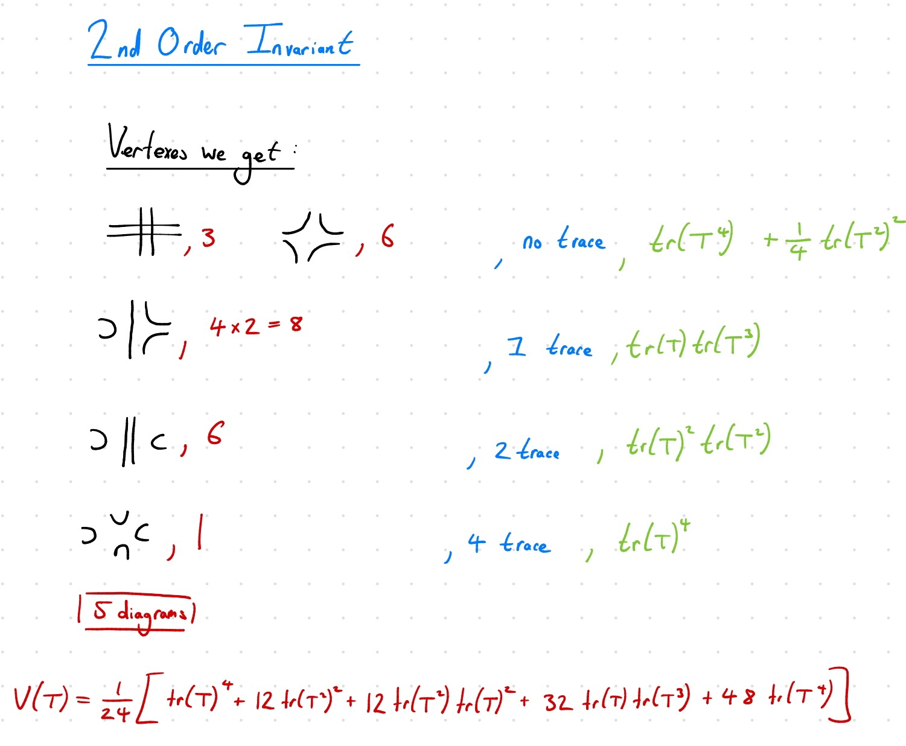

  
   
  <em>The potential in matrix field theory for a 2nd order Martin invariant. We are currently attempting to generalise this method to higher orders, as well as eventually caculate the asymtotics of these theories</em>

<!--  -->

<!-- **Field** Combinatorial Quantum Field Theory -->

**GitHub Repositories:** 
- [O(N) Polynomial for Feynman Graphs (Combinatorial Method)][def]
<!-- - [O(N) Polynomial for Feynman Graphs (Matrix QFT)](#) -->

<!--  -->

# Work in progress
I am currently still working on this project and thus have yet to provide a write-up outlining the topic and my contributions. Below I provide a current update on what we have already achieved, as well as current future aims. 

### What we have achieved so far
<!-- 

  
Meaning of blue

  
Meaning of red

 -->

#### Initial Exploration
- Explored different tensor field theories approaches such as, Edge Colored Graphs and Ribbon Graphs
- Concluded **Ribbon Graphs** as the best approach
- Explored the 7!! decompositions of a 2nd order Martin invariant vertex and ascertained potential interaction terms
- Concluded we need a matrix <i>crossing propagator</i> which induced the matrices to be symmetric in nature

#### Calculating the 2nd Order Martin Invariant Potential

- Weighted potential correctly in order to match to Martin invariant decompositions
- Allowed exploration of simplifications of Lagrangian in order to gain more insight into the theory. Potentially could have links to a bosonic theory
- Needed to be able to check our Lagrangian is correct
- Created code to find the O(N) polynomial for a given Feynman graph ([code can be found here][def])

[def]: https://github.com/BarnabyOBrien/O-N--Polynomial-for-Feynman-Graphs--Combinatorial-Method-

### Current Future Aims
-  Create complimentary code for our constructed Lagrangian and compare to previous code 
-  Explore potential simplifications of Lagrangian which may make calculation of higher orders and asymptotics more feasible
-  If second approach fails continue on old approach for all higher orders 