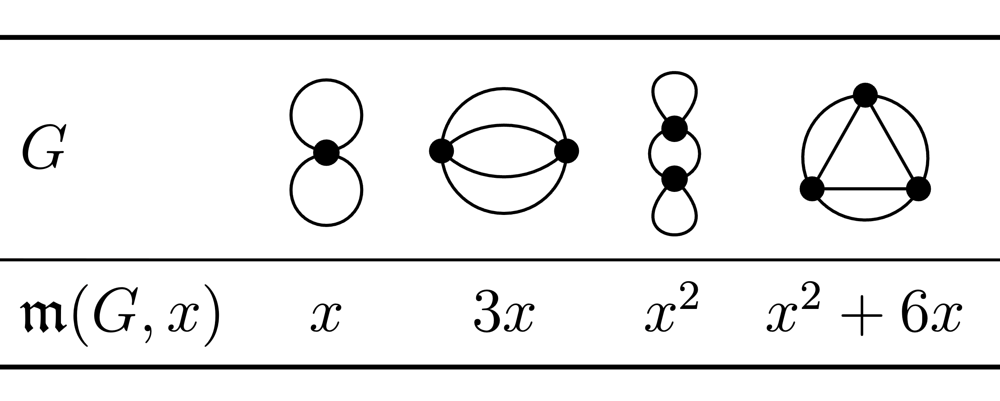

  
   
  <em>The Martin polynomial for a range of low vertex 4-valence graphs</em>

<!--  -->

**Field** Combinatorial Quantum Field Theory

**Github Repositories:** 
- [O(N) Polynomial for Feynman Graphs (Combinatorial Method)](#)
- [O(N) Polynomial for Feynman Graphs (Matrix QFT)](#)

# Introduction
