*Part of my Masters dissertation, "Cosmic Strings: Formation and Observations" (Oxford, Trinity 2026). The results here underpin the assumptions used in the companion project, [Detection of a Kination Peak?]().*

## Contents

1. [Introduction](#introduction)
2. [Background: strings from broken symmetries](#background)
3. [Mathematical framework](#framework)
4. [Implementation in code](#implementation)
5. [Results and analysis](#results)
6. [Conclusion and next steps](#conclusion)
7. [References](#references)

## Introduction {#introduction}

Cosmic strings are line-like topological defects that may have formed during spontaneous symmetry breaking (SSB) in the early universe [[2](#ref-2), [3](#ref-3), [4](#ref-4)]. Whether a network of them survives — rather than taking over the energy budget of the universe — hinges on one micro-physical property: when two strings collide, do they pass through each other or **inter-commute** (exchange partners)? Inter-commuting lets the network chop itself into loops that decay away, and it is *assumed* in essentially every macroscopic model of string networks, including the velocity-dependent one-scale (VOS) model used in gravitational wave forecasts.

The original demonstration of this property (Shellard, 1987 [[1]](#ref-1)) did not come with published code. In this project I rebuilt it: a full 3D lattice simulation of the global \(U(1)\) field theory in MATLAB, written from scratch, that reproduces string–anti-string attraction and annihilation, repulsion of like-winding strings, the break-up of higher winding numbers, and the inter-commuting property itself.

## Background: strings from broken symmetries {#background}

A global \(U(1)\) symmetry appears in several well-motivated theories — the Peccei–Quinn solution to the strong CP problem [[5](#ref-5), [6](#ref-6)], or the \(U(1)_{B-L}\) of \(SU(5)\) [[7]](#ref-7) — but the vacuum structure barely cares which. The model is a complex scalar field with a Mexican-hat potential:

$$
\mathcal{L} = \partial_\mu\phi^{\dagger}\partial^\mu\phi - \frac{\lambda}{2}\left(\phi\phi^\dagger-\tfrac{1}{2}\eta^2\right)^2
$$

The vacuum states \(\phi = \frac{\eta}{\sqrt{2}}e^{i\alpha_0}\) form a circle \(S^1\). Because the fundamental group \(\pi_1(S^1) \cong \mathbb{Z}\) [[8]](#ref-8) is non-trivial, the field can wrap around this circle as you travel around a loop in space, and that **winding number** \(k \in \mathbb{Z}\) cannot be undone by any smooth deformation. Somewhere inside any loop with \(k \neq 0\), the field must leave the vacuum — that line of trapped potential energy *is* the cosmic string.

A single static string is described by the cylindrically symmetric ansatz

$$
\phi = \frac{\eta}{\sqrt{2}}f(r)\,e^{ik\theta}
$$

whose radial profile satisfies (after rescaling \(r\))

$$
f'' + \frac{f'}{r}-\frac{k^2}{r^2}f-\frac{1}{2}(f^2-1)f=0
$$

with \(f(0) = 0\) (regularity at the core) and \(f \to 1\) at infinity (vacuum at the boundary). Numerically solving this gives the profiles below. One quirk worth noting: unlike gauge strings, the energy per unit length of a global string diverges logarithmically with distance — in practice cut off by the distance to the nearest neighbouring string.

<figure style="margin:0;">
  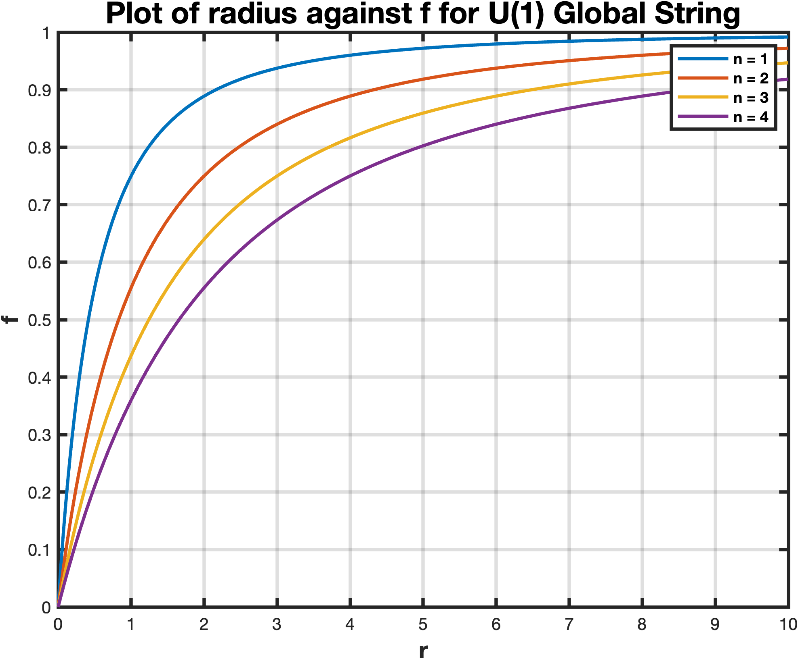
  <figcaption><strong>Fig. 1</strong> — radial profile f(r) of the U(1) global string for different winding numbers, computed in MATLAB.</figcaption>
</figure>

## Mathematical framework {#framework}

To simulate *dynamics*, three more ingredients are needed.

**Equation of motion.** Varying the Lagrangian gives (with \(\beta = \frac{\lambda\eta^2}{2}\)):

$$
\ddot{\phi} = \left(\nabla^2 - \beta\left(|\phi|^2 - 1\right)\right)\phi
$$

**Multi-string initial conditions.** For well-separated strings, the product ansatz (Abrikosov [[9]](#ref-9)) approximates the multi-string field as a product of single-string solutions:

$$
\hat{\Phi}(\mathbf{r}) = \prod_{k=1}^{n} \phi_s(\mathbf{r} - \mathbf{r}_k)
$$

**Moving strings.** The equation of motion is Lorentz invariant, so a moving string is just a boosted stationary one: build the ansatz in the boosted frame, substitute back the lab coordinates, and read off both \(\phi\) and \(\dot\phi\) (the time derivative picks up a \(\gamma v\, \partial_y \phi\) term).

The second-order equation of motion is integrated with a **leapfrog scheme**, staggering the field and its time derivative by half a step:

$$
\dot{\phi}_{i+\frac{1}{2}} = \dot{\phi}_{i-\frac{1}{2}} + \left( \nabla^2 \phi_i - \beta ( \phi_i^\dagger \phi_i - 1 )\phi_i \right)\Delta t, \qquad
\phi_{i+1} = \phi_i + \dot{\phi}_{i+\frac{1}{2}} \Delta t
$$

Leapfrog is the right tool here: it is symplectic, so energy errors stay bounded over the thousands of steps needed to watch a collision play out.

## Implementation in code {#implementation}

Everything runs on a uniform 3D grid (`meshgrid`), with the full code in Appendix A of the dissertation. The key parameters:

| Parameter | Value | Meaning |
|---|---|---|
| \(L\) | 40 | Box side length |
| \(N\) | 70 | Grid points per axis (343k total) |
| \(\Delta x\) | \(L/N \approx 0.57\) | Lattice spacing |
| \(\Delta t\) | 0.1 | Leapfrog time step |
| Steps | 5000 | Total updates per run |
| \(\beta^2\) | 1 | Potential strength |

The pipeline, function by function:

**`makeString(r0, n0, k, X, Y, Z)`** places a string at position `r0` along direction `n0` with winding number `k`. It builds an orthonormal basis for the transverse plane (guarding against picking a reference vector parallel to the string), projects the grid onto that plane, and evaluates the ansatz \(\phi = \tanh(r)\, e^{ik\theta}\) — with `atan2` doing the work of a singularity-free azimuthal angle.

**`CreateString(...)`** wraps this with the Lorentz boost, returning both the boosted field and its initial time derivative.

**Initial conditions** multiply the individual string fields together per the product ansatz; the product rule gives the composite \(\dot\phi\).

**The main loop** applies the leapfrog update — the Laplacian is a single call to MATLAB's `del2` — and computes the local energy density

$$
E = |\dot\phi|^2 - |\nabla\phi|^2 - \beta^2\left(|\phi|^2 - 1\right)^2
$$

**Visualisation** happens two ways: a 3D isosurface of the energy at its 99.9th percentile (which traces the string cores as tubes), and a top-down view summing energy along one axis into a grayscale heat map. Percentile-based thresholds turned out to be much more robust than fixed values, since the energy scale drifts as strings radiate.

## Results and analysis {#results}

**Attraction and annihilation.** Strings with opposite winding numbers attract, accelerate into each other, and annihilate — the trapped energy is released and radiates outwards as scalar waves (Fig. 2, a–d).

**Repulsion.** Strings with the same winding sign repel (Fig. 2, e–g).

**Break-up of higher windings.** A string with \(|k| > 1\) is unstable: it splits into \(|k|\) separate \(k = \pm 1\) strings (Fig. 2, h–j).

<figure style="margin:0;">
  

    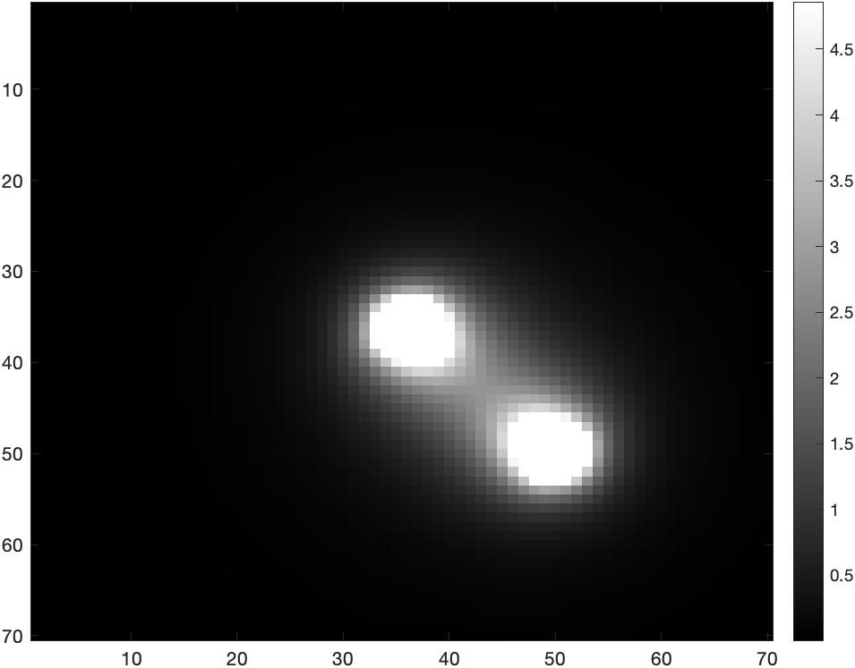
    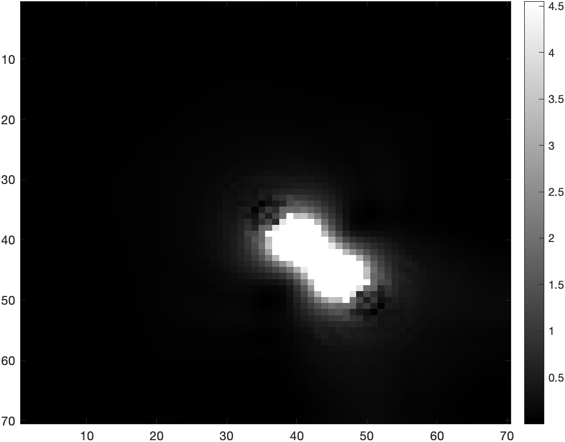
    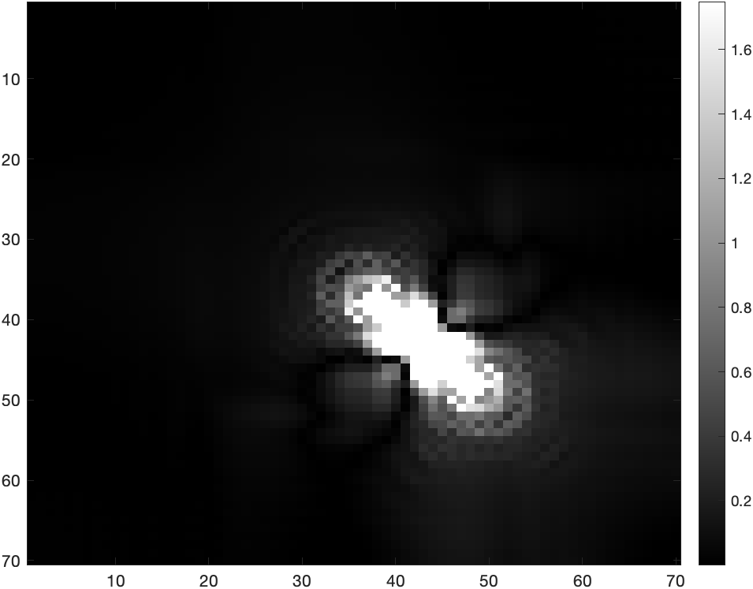
    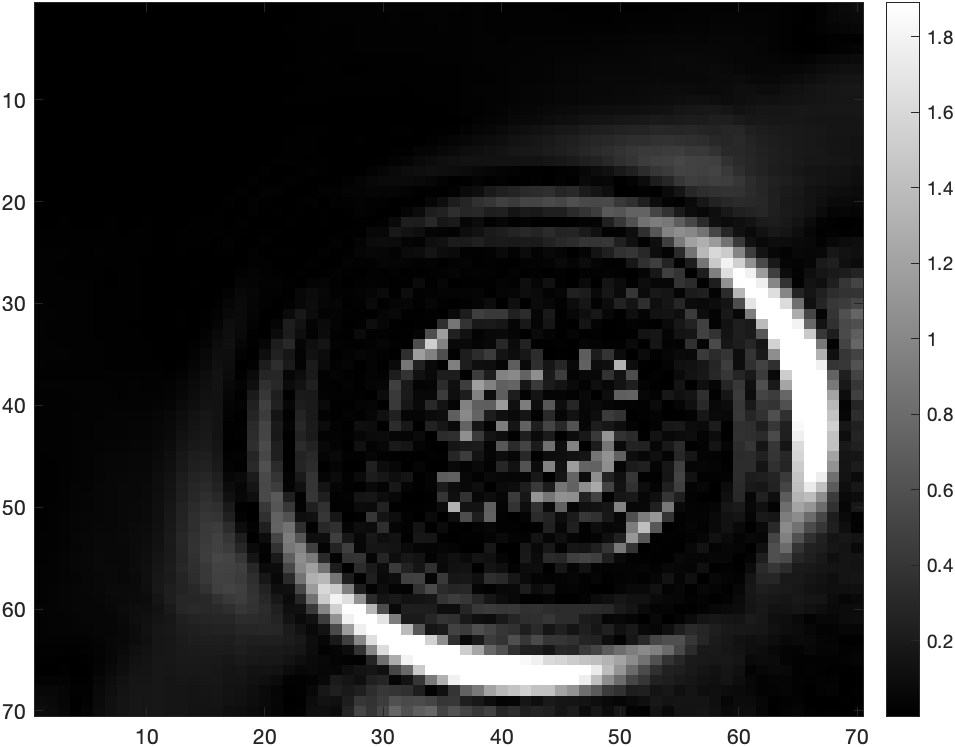
  

  

    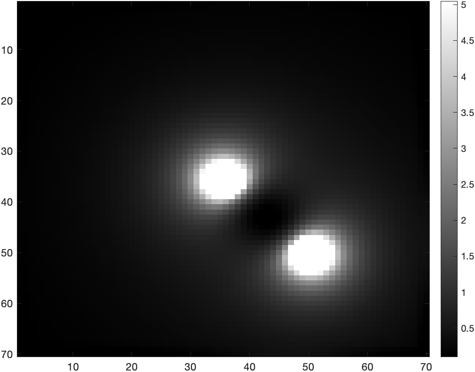
    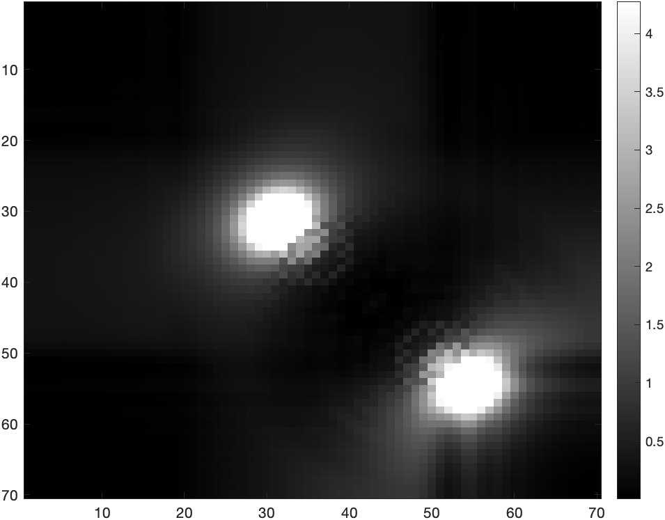
    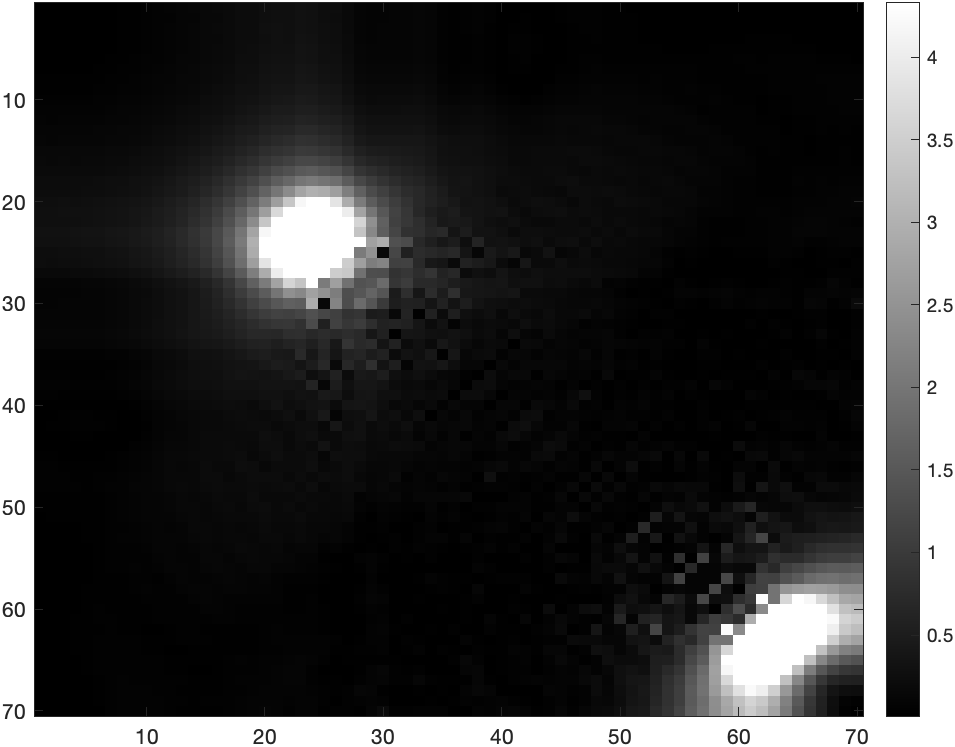
  

  

    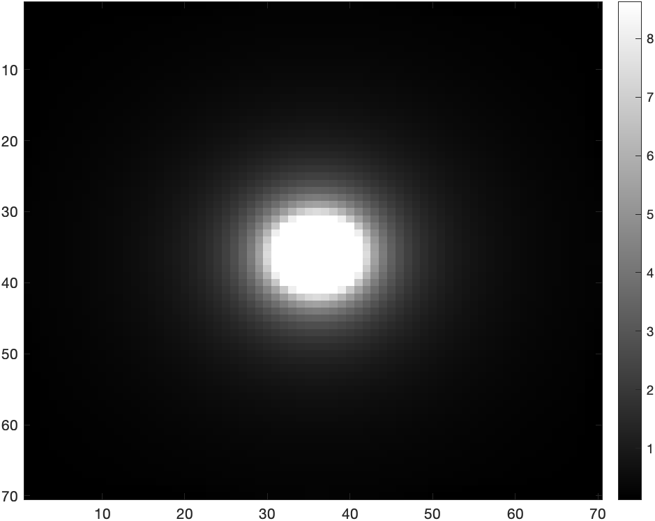
    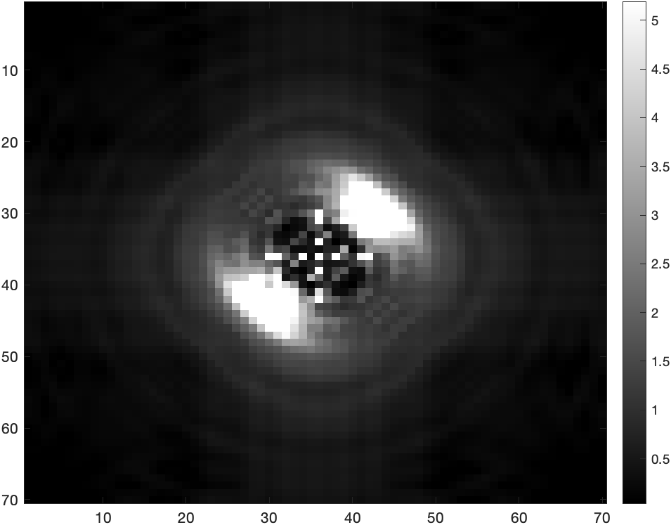
    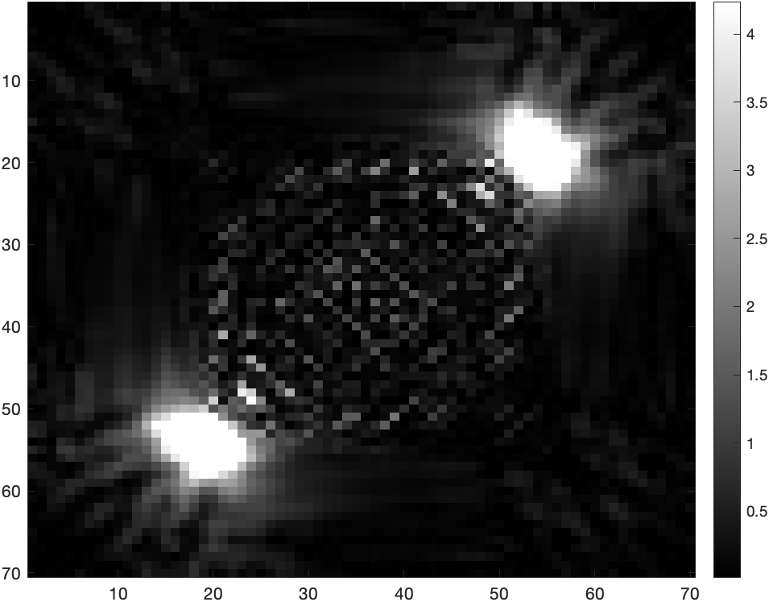
  

  <figcaption><strong>Fig. 2</strong> — top-down views of the energy density. <strong>(a–d)</strong> attraction and annihilation of a string–anti-string pair; <strong>(e–g)</strong> repulsion of like-winding strings; <strong>(h–j)</strong> a k = 2 string breaking into two k = 1 strings.</figcaption>
</figure>

**Inter-commuting.** The headline result: sending one string moving at \(v = 0.5\) through a second, perpendicular one. Rather than passing through, the strings exchange partners at the collision point (Fig. 3) — reproducing the classic result [[1]](#ref-1) and providing the loop-production mechanism every network model relies on. Without it, straight strings would eventually dominate the expansion of the universe [[11]](#ref-11).

<figure style="margin:0;">
  

    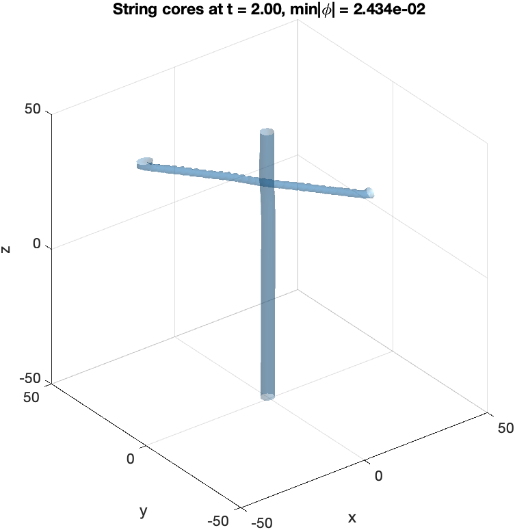
    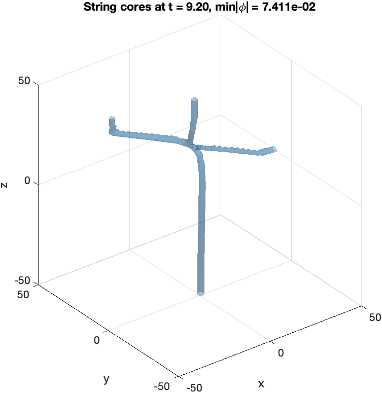
    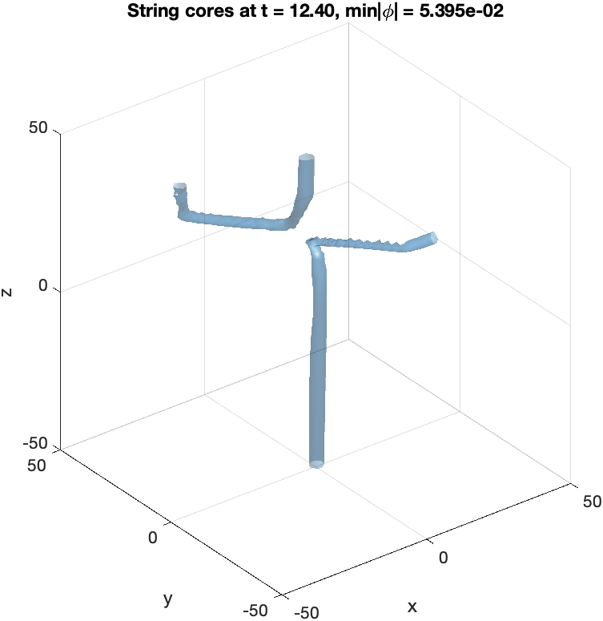
  

  <figcaption><strong>Fig. 3</strong> — 3D isosurface view of two U(1) strings colliding at v = 0.5 and inter-commuting: the strings exchange partners rather than passing through each other.</figcaption>
</figure>

The outcomes, in one table:

| Configuration | Winding numbers | Outcome |
|---|---|---|
| Parallel string + anti-string | \(+1, -1\) | Attract → annihilate, energy radiates away |
| Parallel like-winding strings | \(+1, +1\) | Repel |
| Single higher-winding string | \(k = 2\) | Splits into two \(k=1\) strings |
| Perpendicular strings, \(v = 0.5\) | \(+1, +1\) | **Inter-commute** (exchange partners) |

There's a neat structural corollary. Flipping a string's orientation flips the sign of its winding number, so a network of \(\pm 1\) strings is really a network of \(+1\) strings viewed from different directions — and since any \(|k| > 1\) string decays into \(|k|\) unit strings, **every string network can be treated as made of unit-winding strings**. That assumption feeds directly into the random-walk description of string networks [[10]](#ref-10) and the VOS model used in the [kination project]().

## Conclusion and next steps {#conclusion}

Starting from nothing but a Lagrangian, this project built up initial conditions, dynamics, and visualisation for interacting global \(U(1)\) strings, and recovered every classic phenomenological result — attraction, repulsion, annihilation, higher-winding break-up, and inter-commuting — with clean, reproducible code where the original literature provided none.

The honest limitation is computational: at \(70^3\) grid points, higher winding numbers and higher collision velocities go unstable before they get interesting. The natural next steps are a GPU port (the update is embarrassingly parallel — `gpuArray` would likely give an order of magnitude), absorbing boundary conditions to stop radiated energy re-entering the box, and extending to the *gauge* \(U(1)\) string, where the covariant derivative and gauge field dynamics make both the physics and the numerics richer. On the physics side, the same machinery could measure the loop-chopping efficiency \(\tilde{c}\) [[12]](#ref-12) directly — the one simulation-derived constant the VOS model takes on faith.

## References {#references}

1. E. P. S. Shellard, "Cosmic string interactions", *Nuclear Physics B* **283**, 624–656 (1987). [doi:10.1016/0550-3213(87)90290-2](http://dx.doi.org/10.1016/0550-3213%2887%2990290-2)
2. A. Vilenkin and E. P. S. Shellard, *Cosmic Strings and Other Topological Defects*, Cambridge University Press (2001).
3. M. B. Hindmarsh and T. W. B. Kibble, "Cosmic strings", *Reports on Progress in Physics* **58**, 477–562 (1995). [doi:10.1088/0034-4885/58/5/001](https://doi.org/10.1088/0034-4885/58/5/001)
4. T. W. B. Kibble, "Some implications of a cosmological phase transition", *Physics Reports* **67**, 183–199 (1980). [doi:10.1016/0370-1573(80)90091-5](https://doi.org/10.1016/0370-1573%2880%2990091-5)
5. R. L. Davis, "Cosmic axions from cosmic strings", *Physics Letters B* **180**, 225–230 (1986). [doi:10.1016/0370-2693(86)90300-X](https://doi.org/10.1016/0370-2693%2886%2990300-X)
6. G. Dvali, L. Komisel and A. Wachowitz, "Cosmic strings and domain walls of the QCD quark condensate with and without a hidden axion", *Physical Review D* **112** (2025). [doi:10.1103/rqt3-w6c8](https://doi.org/10.1103/rqt3-w6c8)
7. A. Vilenkin and A. E. Everett, "Cosmic Strings and Domain Walls in Models with Goldstone and Pseudo-Goldstone Bosons", *Physical Review Letters* **48**, 1867–1870 (1982). [doi:10.1103/PhysRevLett.48.1867](https://doi.org/10.1103/physrevlett.48.1867)
8. D. R. Licata and M. Shulman, "Calculating the Fundamental Group of the Circle in Homotopy Type Theory", *Proceedings of LICS 2013*, 223–232 (2013). [doi:10.1109/LICS.2013.28](https://doi.org/10.1109/LICS.2013.28)
9. A. A. Abrikosov, "On the magnetic properties of superconductors of the second group", *Soviet Physics JETP* **5**, 1174–1182 (1957).
10. R. J. Scherrer and J. A. Frieman, "Cosmic strings as random walks", *Physical Review D* **33**, 3556–3559 (1986). [doi:10.1103/PhysRevD.33.3556](http://dx.doi.org/10.1103/PhysRevD.33.3556)
11. T. Vachaspati and A. Vilenkin, "Formation and evolution of cosmic strings", *Physical Review D* **30**, 2036–2045 (1984). [doi:10.1103/PhysRevD.30.2036](http://dx.doi.org/10.1103/PhysRevD.30.2036)
12. T. W. B. Kibble, "Evolution of a system of cosmic strings", *Nuclear Physics B* **252**, 227 (1985); erratum *ibid.* **261**, 750 (1985). [doi:10.1016/0550-3213(85)90596-6](http://dx.doi.org/10.1016/0550-3213%2885%2990596-6)
